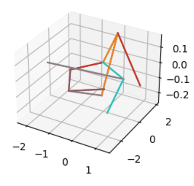
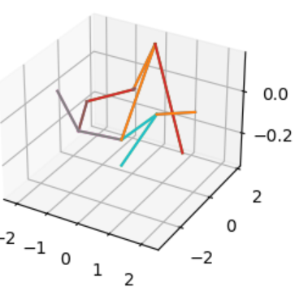
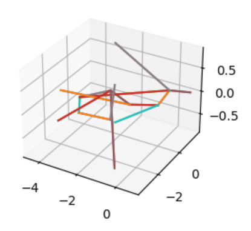
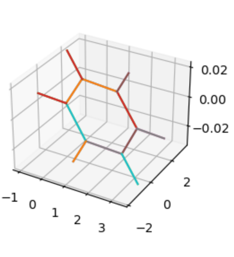
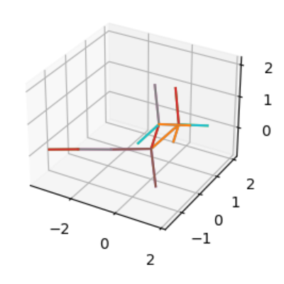

# GeoMol conformers

The conformers generated by GeoMol sometimes are of very poor quality if there is a ring in the molecule.

If there is no ring involved or the ring is "simple", the generated conformers are of better quality.

